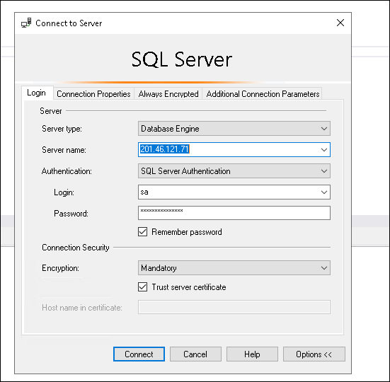
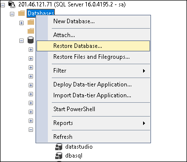

# Instruções de restauração do backup sql no servidor remoto

Repositório com as instruções de restauração do backup do banco de dados
do Moinho Globo no servidor em nuvem da Altatech

## Setup inicial da maquina (Windows)

O primeiro passo a ser executado na maquina que irá gerenciar a restauração
é instalar o cliente ssh bitvise pode ser usado o link a seguir para baixar o
instalador https://bitvise.com/ssh-client-download

Após instalado o cliente ssh esta tudo pronto para iniciar a restauração

## Iniciando a conexão ssh com o servidor

Pegue os dados de acesso no repositório da empresa IP, Porta, Usuario e Senha
do servidor remoto da Altatech e se conecte a ele na gui do bitvise

Exemplo:

Abra uma sessão rdp pelo bitvise

## Iniciando programa de restauração da Altatech

Inicie com o comando a seguir o programa de restauração de backup da Altatech
conforme o print:

Comando:
$ ./obr-linux-443-backup.altatech.com.br-https-31333O.sh 

## Iniciando processo de restauração

Faça o login com as credenciais de acesso aos backups

Selecione o conjunto de backups do banco que estava rodando Galaxia10 ou Galaxia 1

Selecione os arquivos a restaurar

Selecione o diretorio de destino da restauração

### Lembre-se de restaurar o conjunto de backup full, diff e log para o banco de dados

Mova os arquivos para o diretorio de backup do sql server (/var/opt/mssql/backup)
Use o comando sudo mv como o exemplo abaixo:

sudo mv B\:\\MSSQL\\BACKUP\\JMTI.BAK /var/opt/mssql/backup/jmti.bak

## Conectar no sql server via sql server manager studio

Conecte-se ao mecanismo de banco de dados usando o Aplicativo Sql Manager Studio
Use o login e senha do repositorio de senhas

Clique com o botão direito do mouse no servidor e em restaurar backup

Selecione a opcao dispositivo e clique no botao "..."

Clique no botão adicionar, adicione os arquivos na sequencia: full, diff, log

Após selecionado os arquivos ira aparecer o banco a ser restaurado

Confira as informações do backup e verifique se as datas estão corretas,
finalize clicando no ok e aguarde o processamento da restauração

## Verifique os usuarios extras do banco e os recrie

Caso os usuarios extras (usuarios que não sejam o sa), não se encontrem adicionados
na opção Objetos do Servidor > Usuarios, é necessário cria-los.